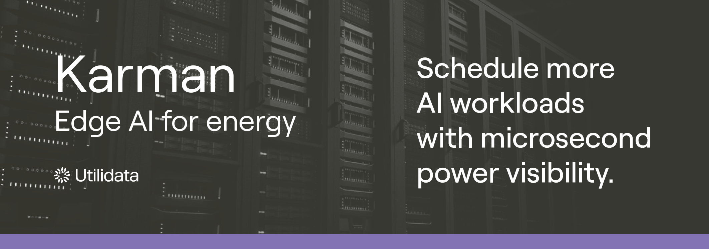
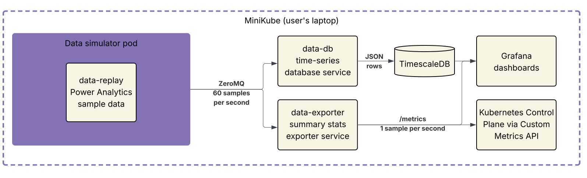
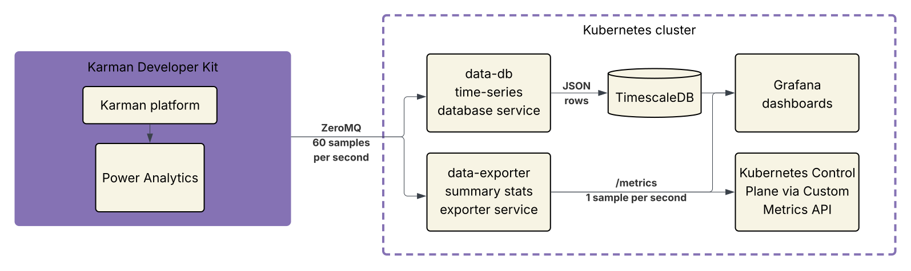

# Karman Power Aware Module

Low latency, high-resolution power-aware data products to increase compute capacity in AI data centers.

# **Research Preview**

Karman is a distributed AI platform, powered by a custom NVIDIA system on module (SOM), that processes high-resolution power system metrology to enable real-time decision-making and controls in AI data centers. Karman integrates directly with data center power distribution hardware, including PDUs and power trays. This integration allows Karman to produce data products that capture the complexity of AI workloads and their associated, often highly variable, power consumption.

This research preview offers samples of Karman’s initial data product, Power Quality Analytics, through a minimal Kubernetes reference implementation. The preview demonstrates how to integrate Karman data products with servers in the AI data center, a crucial first step towards power-aware operations and increasing data center computing capacity with Karman. 

Karman data products enable advanced custom-built use cases, including server and rack-level power forecasting, GPU/PSU failure prediction, thermal hot spot detection, phase balancing optimization, power-aware scheduling, and optimal power oversubscription strategies.

Karman data center developer kits are available for [pre-order](https://utilidata.com/interest-form/github).

# **The Era of Power-Constrained AI Data Centers**

AI data centers are quickly reaching the limits of their provisioned poweroutgrowing existing power infrastructure. Current best practices for managing and using compute resources include many optimizations, but they typically don’t consider granular real-time energy use. Operators cannot fully manage their power budget and maximize compute without a detailed understanding of server-level power behavior. This orchestration gap is exactly what Karman is built to close.

Karman is framework agnostic and provides server-level power-aware data products with the following characteristics:

* **High-resolution** \- Delivers “single cycle” AC waveform statistics, with support for 1+ MS/s sample rates.   
* **Low latency** \- Serializes data products as Protocol Buffers (protobuf) and transports via ZeroMQ to achieve sub-millisecond messaging.  
* **Extensible** \- Enables distributed AI models on the platform to utilize Power Quality Analytics as inputs for training models and generating new data products, such as power forecasting and workload characterizations.   
* **Configurable** \- Allows easy configuration of data product resolution and transported messages through the upcoming Developer Kit and corresponding application development environment. 

Built in Rust for performance, the Karman Power Aware Module is a fully open-source module and intended to operationalize Karman's hardware.

# **Components**

This research preview demonstrates the following components in a minimal Kubernetes deployment:

| Component | Description |
| :---- | :---- |
| <br>`data-replay`<br><br>Kubernetes pod with sample data snapshots and data transport mechanisms | Provides CSV snapshots of 3-phase power analytics data recorded in the Utilidata lab. Power analytics provided “single cycle” analytics on AC waveforms as measured by 32 kilosamples per second current and voltage metrology. <br><br>Snapshots are serialized via protobuf and published to a ZeroMQ topic. This enables data replay in Karman’s protocols without requiring users to have Karman hardware. |
| <br>`data-db`<br><br>Kubernetes pod for power analytics time-series database sink service  | Service that reads Karman’s per-cycle power analytics (\~60 samples per second) data from the `data-replay` pod above and writes to TimescaleDB for time-series visualization via Grafana dashboard. Includes logic for 3-phase data products. |
| <br>`data-exporter`<br><br>Kubernetes pod for power analytics summary stats exporter service | Service reads the same bibimbap data from the `data-replay`<br><br>pod above and exports summary statistics of that data at 1 sample per second for Prometheus. Includes logic for 3-phase data products.  |
| Helm chart | Packages the three Kubernetes pods above for easy deployment; default configuration includes Prometheus, Grafana, and TimescaleDB. |
| Grafana dashboards | Two pre-configured dashboards corresponding to `data-db` and `data-exporter` services. |

<br><br>

<br><br>
---

## **Getting Started**

This deployment runs self-contained on Minikube for evaluation, or deploys to customer clusters with the upcoming Karman developer kit.

## **Quick Start**

**Prerequisites:**
- Docker running ([install guide](https://docs.docker.com/desktop/setup/install/))
- Minikube installed ([install guide](https://minikube.sigs.k8s.io/docs/start/))
- Helm 3 installed ([install guide](https://helm.sh/docs/intro/install/))
- Git (to clone the repository)

Clone the repository and navigate to it:

```shell
# Clone the repository
git clone https://github.com/utilidata/power-aware-module.git
cd power-aware-module
```

**Start the demo:**

```shell
# 1. Start Minikube
minikube start --cpus 4 --memory 7168 --kubernetes-version=v1.33.0

# 2. Add Helm repo
helm repo add prometheus-community https://prometheus-community.github.io/helm-charts

# 3. Fetch Helm dependencies
helm dependency update charts/karman-lab

# 4. Install Prometheus Operator CRDs (one-time requirement)
helm install kps-crds prometheus-community/prometheus-operator-crds \
  --version 23.0.0 \
  --namespace karman --create-namespace || true

# 5. Install the Karman stack
helm upgrade --install karman-lab charts/karman-lab --namespace karman

# 6. Wait for all pods to be ready (this may take 2-3 minutes)
kubectl wait --for=condition=ready pod --all -n karman --timeout=300s

# 7. Verify all pods are running
kubectl -n karman get pods

# 8. Open Grafana
kubectl -n karman port-forward svc/karman-lab-grafana 3000:80
```

**Access Grafana:** Browse to [http://localhost:3000](http://localhost:3000)  
**Login:** `admin` / `karman`

**Dashboards available:**

1. **Summary Statistics (**`data-exporter`**)** \- Key metrics at a glance: real/reactive power, voltage, current, and power factor with trend graphs  
2. **Per-Cycle Time Series (**`data-db`**)** \- High-resolution (\~60 Hz) waveform analysis from TimescaleDB

## **Viewing Replay Data**

`data-replay` publishes a pre-recorded snapshot of Karman Power Analytics data on startup. Snapshots were recorded using a B200 HGX (8-GPU) server in the Utilidata lab with Karman hardware monitoring three-phase power at PDU inlet. Sample data scenarios include:

| Scenario | Description |
| :---- | :---- |
| `sample1-b200-no-powercap`  | A 3-minute workload trace was conducted, simulating up to 1,000 requests per minute. The Qwen3-Coder-480B-A35B-Instruct model was used via vLLM with default batch parameters and no power cap. |
| `sample2-b200-static-powercap` | Same as scenario 1 with power caps set to 300W per GPU |
| `sample3-b200-dynamic-powercap` | Same as scenario 1 with power caps programmed to cycle through three steps in \~10 second increments, 900W, 600W, and 300W per GPU, for the duration of the scenario. |
| `sample4-b200-partial-dynamic-powercap` | Same as scenario 3 with power caps cycling twice during the middle of the scenario.  |

To see updated metrics in the dashboards, restart the data flow:

```shell
# Restart all components with proper timing
./scripts/restart-data-flow.sh
```

This handles the proper restart sequence: `data-replay` first, then consumers (`data-exporter` and `data-db`).

## **Switching Datasets**

Multiple GPU power scenarios are included in the `data-replay` image. Switch between them using the restart script:

```shell
# Switch to a different scenario (e.g., static power cap)
./scripts/restart-data-flow.sh sample2-b200-static-powercap

```

Available datasets:
- [`sample1-b200-no-powercap`](./datasets/sample1-b200-no-powercap.csv) (default) - B200 GPU with no power capping
- [`sample2-b200-static-powercap`](./datasets/sample2-b200-static-powercap.csv) - B200 with static power cap
- [`sample3-b200-dynamic-powercap`](./datasets/sample3-b200-dynamic-powercap.csv) - B200 with dynamic power capping
- [`sample4-b200-partial-dynamic-powercap`](./datasets/sample4-b200-partial-dynamic-powercap.csv) - B200 with partial dynamic capping

All datasets provide 3-6 minutes of real B200 server measurements at 60 samples per second.

## **Switching to Developer Kit Hardware**

Karman developer kits will begin shipping in November. When connecting to a Karman developer kit, switching from replay mode to the developer kit is a simple configuration change:

```shell
helm upgrade karman-lab charts/karman-lab -n karman \
  --set source.mode=live \
  --set source.karmanEndpoint="tcp://<DEVICE_IP>:5557"
```

The downstream services do not require code changes — the same deployment consumes live data from Karman hardware:

<br><br>

<br><br>

## **Troubleshooting**

Installation warnings:

If you see format warnings during installation, your Kubernetes version may be too new. The Quick Start specifies Kubernetes 1.33 for stability and compatibility with the Prometheus Operator. Starting Minikube without the `--kubernetes-version` flag uses the latest version by default, which may produce cosmetic warnings that can be safely ignored.

**Dashboard shows "No Data":**

1. Restart services to generate fresh data (*see* [Viewing Replay Data](#viewing-replay-data))  
2. Check pod logs: `kubectl -n karman logs -l app=data-exporter`

**Pods not starting:**

1. Check status: `kubectl -n karman get pods`  
2. View logs: `kubectl -n karman logs -l app=<pod-name>`  
3. Ensure Minikube has enough resources

## **Cleanup / Reset Environment**

To remove the Karman stack and start fresh:

```shell
# Option 1: Remove just the Karman helm release (keeps Minikube running)
helm uninstall karman-lab -n karman
helm uninstall kps-crds -n karman
kubectl delete namespace karman

# Option 2: Completely destroy and recreate Minikube
minikube delete
minikube start --cpus 4 --memory 8192 --kubernetes-version=v1.33.0
```
